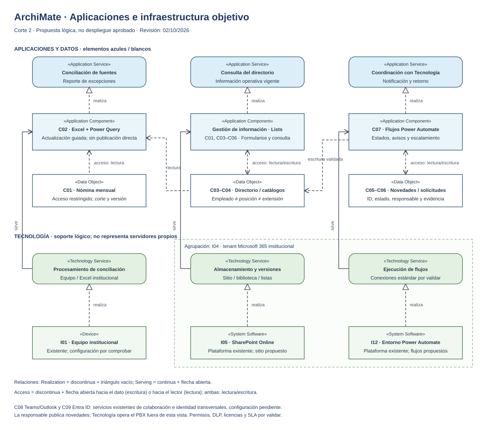

# Informe — Arquitectura Tecnológica e Infraestructura

**Fase:** Technology Architecture · TOGAF ADM · Corte 2  
**Modelo:** [Mapa de infraestructura](mapa-final.drawio)

**Vista complementaria:** [ArchiMate editable](vista-integrada-archimate.drawio) · [Vista previa SVG](vista-integrada-archimate.svg)

## 1. Propósito

Este documento ubica los contenedores del modelo C4 sobre la infraestructura institucional. La solución se plantea como un servicio SaaS dentro del tenant Microsoft 365 de la Universidad. No requiere servidores propios, instalación local adicional, base de datos externa ni exposición de servicios a Internet.

Como evidencia del entorno actual, la cliente confirmó que el directorio se aloja en OneDrive y que la coordinación con Tecnología ocurre por Teams o reunión. Indicó que las soluciones dentro de la suite Microsoft son aceptables y que cuenta con un licenciamiento ordinario, pero no confirmó permisos para crear sitios/listas ni capacidades concretas de Power Automate. Por ello, el diseño se limita a conectores estándar y mantiene la comprobación de permisos y licencias como condición de implantación.

El mapa diferencia claramente:

- Componentes existentes confirmados por el cliente.
- Componentes objetivo propuestos.
- Sistemas externos fuera del alcance.
- Controles y decisiones que todavía debe validar Tecnología.

## 2. Inventario de infraestructura

### Vista integrada de aplicaciones y tecnología

La [vista ArchiMate](vista-integrada-archimate.drawio) complementa C4 y el mapa de infraestructura, conservando sus IDs. Usa un subconjunto de **ArchiMate 3.2** y notación alternativa con el tipo de elemento explícito: Application Component, Application Service, Data Object, Technology Service, Device y System Software. Los servicios tecnológicos representan el soporte SaaS/local de la solución, no servidores dedicados ni componentes nuevos instalados. La agrupación del tenant indica contexto institucional, no una conexión de red ni un permiso implícito.

Relaciones empleadas:

- **Realization:** componente/proveedor hacia servicio realizado, discontinua con triángulo vacío. El soporte proveedor–servicio se resume como relación derivada, omitiendo funciones internas.
- **Serving:** servicio tecnológico hacia componente al que ofrece soporte, continua con flecha abierta.
- **Access:** discontinua; flecha hacia el lector para lectura, hacia el dato para escritura, ambas para lectura/escritura. Power Query lee; los flujos escriben solo cambios validados.

Los componentes de gestión agrupan la biblioteca y las listas lógicas de C4. C08 (Teams/Outlook) y C09 (Entra ID) se declaran como dependencias transversales en la nota de la vista; sus configuraciones se detallan en el mapa existente. La vista no pretende modelar el PBX ni sustituir el [contrato de datos](../03-arquitectura-c4/esquema-datos-to-be.md). Fuente metodológica: [ArchiMate 101, comunidad de The Open Group](https://archimate-community.pages.opengroup.org/workgroups/archimate-101/).

### Inventario detallado

| ID | Componente | Tipo | Estado | Propietario | Función |
|---|---|---|---|---|---|
| I01 | Equipos institucionales | Endpoint administrado | Existente | Universidad | Acceso de gestoras, Experiencia y Servicio y Tecnología |
| I02 | Red y acceso a Internet institucional | Conectividad | Existente | Universidad | Acceso a Microsoft 365 y sistemas internos |
| I03 | Microsoft Entra ID | Identidad SaaS | Existente, por validar configuración | Tecnología | Autenticación y grupos de acceso |
| I04 | Tenant Microsoft 365 | Plataforma SaaS | Existente | Universidad | Frontera de confianza de la solución |
| I05 | Sitio de SharePoint del proceso | Servicio SaaS | Propuesto | Jefatura / Tecnología | Hospeda biblioteca y listas |
| I06 | Biblioteca `EntradasNomina` | Almacenamiento documental | Propuesto | Experiencia y Servicio | Conserva insumos mensuales y versiones |
| I07 | Lista `DirectorioExtensiones` | Almacén estructurado | Propuesto | Experiencia y Servicio | Fuente institucional de consulta |
| I08 | Listas de catálogos | Almacén estructurado | Propuesto | Experiencia y Servicio | Unidades, alias, cargos y reglas |
| I09 | Lista `Novedades` | Almacén estructurado | Propuesto | Experiencia y Servicio | Evidencia de excepciones y decisiones |
| I10 | Lista `SolicitudesAprovisionamiento` | Almacén estructurado | Propuesto | Experiencia y Servicio / Tecnología | Estado del ciclo de aprovisionamiento |
| I11 | Libro de conciliación | Excel/Power Query | Propuesto | Experiencia y Servicio | Prepara datos y genera excepciones |
| I12 | Flujos de Power Automate | Automatización SaaS | Propuesto | Cuenta institucional o propietario definido | Notifica, actualiza estados y escala |
| I13 | Teams y Outlook | Interfaz SaaS | Existente | Universidad | Avisos, respuestas y seguimiento |
| I14 | Sistema de Desarrollo Humano | Sistema externo | Existente, fuera de alcance | Desarrollo Humano | Origina la nómina |
| I15 | PBX | Sistema externo | Existente, fuera de alcance | Tecnología | Administra extensiones reales |

## 3. Vista lógica

### 3.1. Zonas de confianza

| Zona | Componentes | Regla principal |
|---|---|---|
| Usuario institucional | Equipos, navegador, Excel, Teams y Outlook | Solo identidades institucionales autorizadas |
| Tenant Microsoft 365 | SharePoint, Lists, Power Automate y servicios de colaboración | Datos permanecen dentro del tenant y sujetos a sus políticas |
| Sistemas institucionales externos | Desarrollo Humano y PBX | Intercambio mediante exportación o actuación humana controlada |
| Repositorio académico | GitHub | Solo documentación, estructuras y datos ficticios |

### 3.2. Flujos tecnológicos

| # | Origen | Destino | Canal | Datos | Control requerido |
|---|---|---|---|---|---|
| T1 | Sistema RH | Equipo de la responsable | Descarga institucional | Nómina mensual | Verificar origen, fecha y formato |
| T2 | Equipo de la responsable | Biblioteca SharePoint | HTTPS autenticado | Archivo de nómina | Permiso de carga y versionamiento |
| T3 | Power Query | Biblioteca y listas | Conectores de Microsoft 365 | Datos de nómina y directorio | Cuenta autorizada; consulta de solo lectura cuando sea posible |
| T4 | Responsable | Listas de novedades/solicitudes | Navegador o Microsoft 365 | Decisiones y solicitudes | Validaciones de campo y registro de usuario |
| T5 | Power Automate | Teams/Outlook | Conectores estándar | Notificación con mínimo de datos | Evitar anexar la nómina completa |
| T6 | Tecnología | Solicitud | Aprobación/respuesta autenticada | Estado y observación | Usuario, fecha y resultado obligatorios |
| T7 | Power Automate | Directorio | Conector SharePoint | Cambio de estado aprobado | Control de transición y manejo de errores |
| T8 | Tecnología | PBX | Procedimiento interno | Aprovisionamiento/liberación | Fuera del alcance; evidencia de confirmación |

## 4. Acceso y responsabilidades

| Perfil | Biblioteca nómina | Directorio | Catálogos | Novedades | Solicitudes | Flujos |
|---|---|---|---|---|---|---|
| Gestora de servicio | Sin acceso | Lectura | Sin acceso | Sin acceso | Sin acceso | Sin acceso |
| Profesional de Experiencia y Servicio | Carga/lectura | Edición | Edición controlada | Edición | Crear/consultar | Operación; no necesariamente administración |
| Jefe de la unidad | Lectura según necesidad | Lectura | Lectura | Lectura | Seguimiento | Sin administración |
| Analista de Tecnología | Sin acceso a nómina completa | Lectura mínima si se justifica | Sin acceso | Sin acceso | Responder asignadas | Sin administración |
| Propietario técnico del flujo | Acceso técnico mínimo | Según cada flujo | Según cada flujo | Según cada flujo | Según cada flujo | Administración |
| Administrador Microsoft 365 | Según función administrativa | Según función administrativa | Según función administrativa | Según función administrativa | Según función administrativa | Administración del tenant |

La matriz es una propuesta de mínimo privilegio. Tecnología y el responsable de protección de datos deben aprobarla antes de implantarla.

## 5. Entornos y promoción

No se asume la disponibilidad de tenants separados. Se propone una separación lógica dentro del mismo tenant:

| Entorno | Datos | Componentes | Uso |
|---|---|---|---|
| Pruebas | Ficticios o anonimizados | Sitio/listas con sufijo `-PRUEBAS`; copias de flujos deshabilitadas por defecto | Verificar esquema, consultas y transiciones |
| Producción | Datos institucionales autorizados | Sitio y listas definitivos; flujos con propietario y co-propietario | Operación mensual |

La promoción debe usar una lista de verificación: columnas, permisos, conexiones, propietarios, destinatarios, límites, manejo de errores y evidencia de prueba. Nunca se debe probar un cambio destructivo sobre la lista de producción.

## 6. Operación y continuidad

### 6.1. Propiedad

- El sitio y los flujos deben pertenecer a identidades institucionales con continuidad, no a cuentas académicas del equipo.
- Cada flujo debe tener propietario operativo y co-propietario técnico.
- Las conexiones deben documentar la cuenta utilizada y su procedimiento de reemplazo.

### 6.2. Respaldo y recuperación

- Habilitar y verificar historial de versiones para archivos y listas.
- Definir retención y restauración con Tecnología; este documento no presume periodos concretos.
- Exportar periódicamente la configuración de los flujos conforme a la práctica autorizada por el tenant.
- Mantener documentados los esquemas de listas y el procedimiento manual de contingencia.

### 6.3. Monitoreo

| Evento | Evidencia | Respuesta esperada |
|---|---|---|
| Flujo fallido | Historial de ejecuciones y alerta | Responsable revisa y reintenta de forma controlada |
| Archivo mensual ausente | No existe carga para el periodo esperado | Aviso a la responsable; no se reemplaza el directorio anterior |
| Solicitud vencida | Estado y fecha de vencimiento | Escalamiento al rol acordado |
| Registro sin llave | Excepción en conciliación | Revisión humana; no se actualiza automáticamente |
| Cambio masivo inesperado | Cantidad de novedades fuera del patrón | Detener publicación y validar insumo |

El umbral de “cambio masivo” debe definirse con el cliente. Los valores históricos de 5 a 10 novedades sirven como referencia, no como regla automática definitiva.

## 7. Riesgos tecnológicos

| ID | Riesgo | Consecuencia | Tratamiento propuesto |
|---|---|---|---|
| RT1 | Propietario único del flujo deja la organización | Automatizaciones huérfanas o conexiones inválidas | Co-propiedad institucional y revisión periódica |
| RT2 | Conector o acción requiere licencia no disponible | Flujo no desplegable | Diseño con conectores estándar y prueba de licencia antes de construir |
| RT3 | Política DLP bloquea una combinación de conectores | Flujo no se puede guardar o ejecutar | Validación previa con administrador Power Platform |
| RT4 | Archivo de nómina cambia de estructura | Consulta falla o produce resultados incorrectos | Validación de columnas, esquema y conteos antes de conciliar |
| RT5 | Permisos heredados exponen la nómina | Acceso no autorizado | Sitio privado, grupos definidos y revisión de permisos |
| RT6 | Notificación contiene datos excesivos | Divulgación innecesaria | Mensaje con ID y enlace; detalle solo en la lista autorizada |
| RT7 | Flujo actualiza un registro equivocado | Corrupción del directorio | Llave estable, control de concurrencia y registro de cambios |
| RT8 | Dependencia de servicios SaaS | Interrupción temporal | Procedimiento manual documentado y reintento controlado |

## 8. Validaciones pendientes

- Arquitectura real del tenant y políticas aplicables.
- Capacidad para crear el sitio, Microsoft Lists y las conexiones; Johanna solicitó aclaración sobre este punto y no confirmó todavía el permiso.
- Clasificación de datos y periodo de retención institucional.
- Mecanismo autorizado para propiedad y continuidad de los flujos.
- Límites efectivos de Power Automate y de los conectores con el licenciamiento asignado.
- Canal objetivo aprobado para interacción con Tecnología; el canal actual confirmado es Teams o reunión con José Roberto.
- Procedimiento de respaldo y restauración disponible para el sitio.

## 9. Conclusión

La propuesta reduce la infraestructura propia a cero y aprovecha la plataforma corporativa ya existente. El riesgo principal no está en servidores o redes, sino en identidad, permisos, propiedad de los flujos, calidad del archivo de entrada y configuración del tenant. Por eso la arquitectura requiere una validación técnica breve con Tecnología antes de implantarse.
